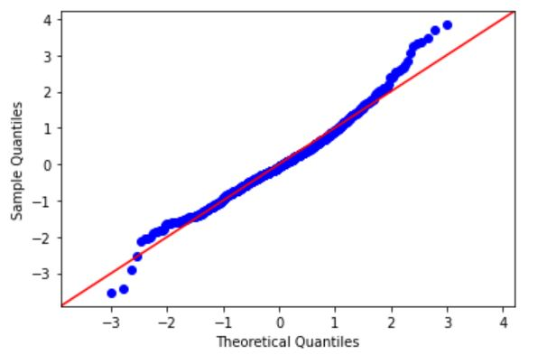
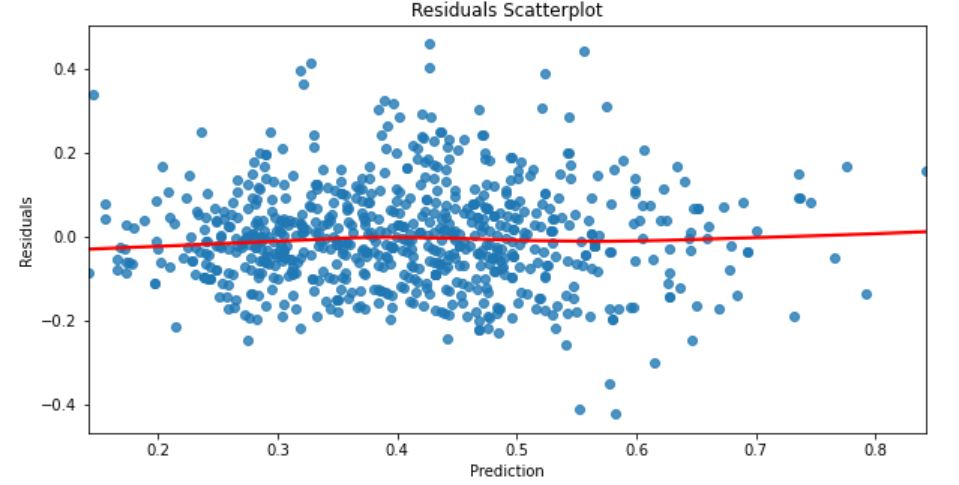
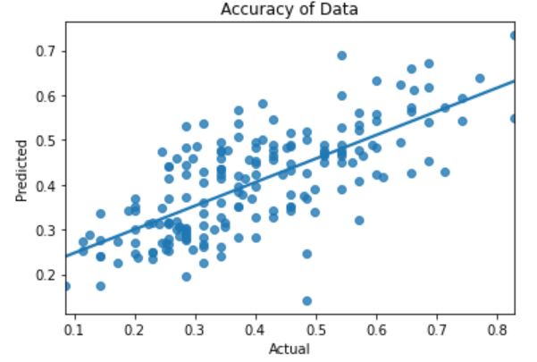

# Pokémon Linear Regression

**Authors**: Ricky Wong

## Overview

With the new Pokémon Scarlet and Violet’s release just around the corner, the competitive Pokémon community are eager to get an edge over the other players by finding the strongest Pokémon. Using linear regression we can highlight two variables that affect the attack of a Pokémon.

## Business Understanding

To get an edge over other players, the enthusiast players would like to predict the attack stats of the next generation Pokémon to see if they are worth using. However, the stats of a Pokémon is not the only variable to consider. Our model will not factor in the moves/skills, items or other game mechanics. 

## Data Understanding

We have obtained the data from Kaggle which uses the Pokémon official site as well as community sites. The data is accurate as it has been extracted from the games. We can see each stat of a Pokémon as well as the name, type, generation and if the Pokémon is legendary or not.
After getting an idea of the data we are dealing with we can see the only null values are from type 2 which is accurate as not all Pokémon have a second type.<br />
Checking the stats between legendary and non-legendary Pokémon we can see they are not too different with highest total stats for legendary is 780 and normal Pokémon highest is 700. Legendary has a larger mean as they don't have to evolve. We can keep legendary Pokémon in our analysis.<br /> 
Other observations
- There are a total of 18 unique Pokémon types.
- Histogram shows the data is slightly positively skewed.
- Hp, defence and special defence has some outliers we can remove

#### Continuous Data
The histograms show the data being positively skewed. We will need to run log transformations to make them more normal.

#### Categorical Data
The house with 33 bedrooms is an outlier which we can drop when cleaning <br />
We can see there wasn't many renovations happening (less than 10) until after 1982 <br />
Knowing if the property has been renovated or not would be more useful than the year the property was renovated 


## Data Preparation

We will start to go through the data and make changes that fit our needs like removing outliers, mega evolutions as that is part of a game mechanic and is not in every Pokémon game and other columns we don’t need like the index number and name. Type 2 will be converted to **1** if it has a second type and **0** if they don't. Total will need to be removed as well because that is just the other stats added up.

#### Check for Multicollinearity
 - No correlations over 0.75 with other predictors.
 - HP and defence are highly correlated with our dependant variable attack

#### Normal distribution of data
- Data looks molstly normal with a slight positive skew.

#### One Hot Encode
For linear regression, categorical data should be transformed using one-hot encoding.


## Modeling

#### Model 1
For the first model we use all the predictors that we think should be useful to our model. With an R-Squared value of 0.530 we can explain 53% of the variations of our model. There are quite a few predictors with a P-value over 0.05 which we can remove from our model.

#### Model 2
After removing the high p-values we still have a few predictors that can be removed. We check our data for multicollinearity which there isn't. We also run a min max scaler so that the stats are all on the same scale. Recursive Feature Elimination helps us find the best predictors to remove.

#### Model 3
With our final model we have an R-Squared value that can explain 50.3% of the variance in our model. All our predictors can be considered statistically significant as their P-Value is less than 0.05.
One of the assumptions for linear regression is that our data needs to have normal distribution. This can be seen with our QQ-Plot mostly falling on the red line. The skew value also reinforces this by being between -0.5 and 0.5. 
Another assumption for linear regression is that the data needs to be homoscedastic which is represented in our residuals scatterplot not having a cone like shape or pattern.

#### Homoscedasticity
Scatterplot to show homoscedasticity. No cone like pattern.


#### Training
With training and test MSE being similar, we can expect the model to perform similarly on different data.<br />
Accuracy of the model is 51.43%



## Conclusions
The best 2 predictors for our model is HP and defence which is also highlighted from the correlation matrix. With an accuracy of 50% this model may not be enough to provide players with enough insight on the upcoming generation of Pokémon. Even if our model had high accuracy with predicting the attack of the new generation there are so many other factors to account for.
Having high attack doesn't mean it is a top tier Pokémon to use as the other stats like speed may be a lot lower meaning that Pokémon attacks second. There are also varying skills and other game mechanics that can change the outcome of a high attack Pokémon versus a low attack Pokémon. 


## For More Information

Please review our full analysis in [our Jupyter Notebook](./Pokemon.ipynb) or our [presentation](./Presentation.pdf).

For any additional questions, please contact ** Ricky wong_ricky@hotmail.com**

## Repository Structure


```
├── README.md                           <- The top-level README for reviewers of this project
├── Pokemon.ipynb                       <- Narrative documentation of analysis in Jupyter notebook
├── notebook.pdf                        <- PDF version of notebook
├── presentation.pdf                    <- PDF version of project presentation
├── github.pdf                          <- PDF version of github  
├── data                                <- Both sourced externally and generated from code
└── images                              <- Both sourced externally and generated from code
```
